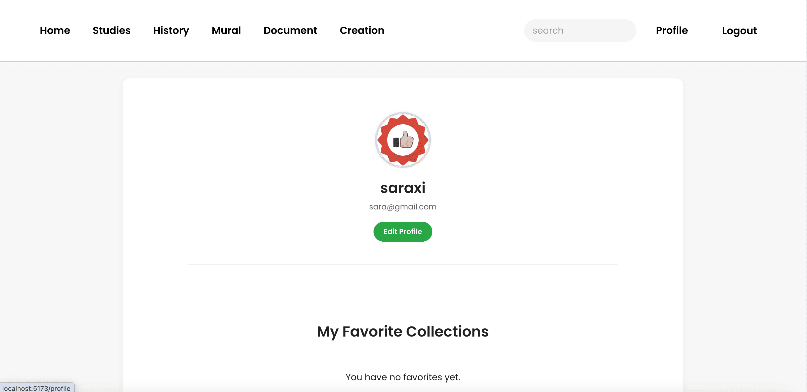
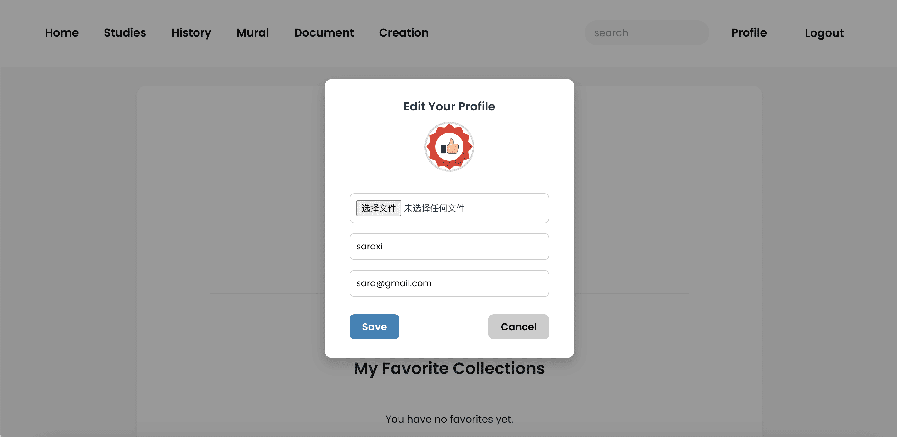
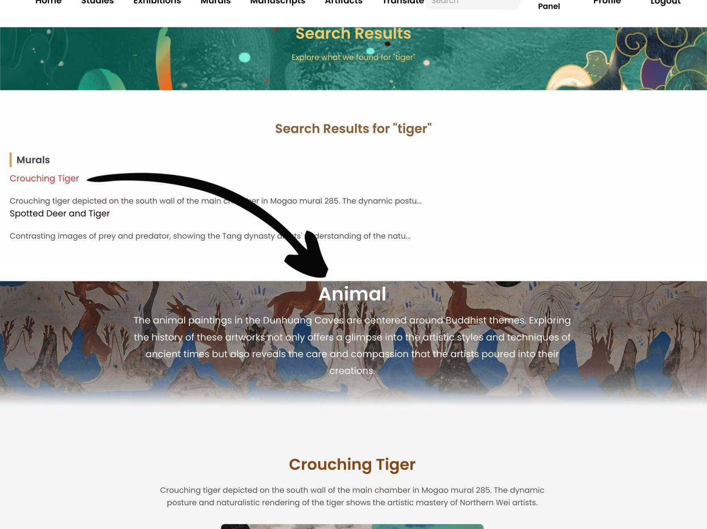
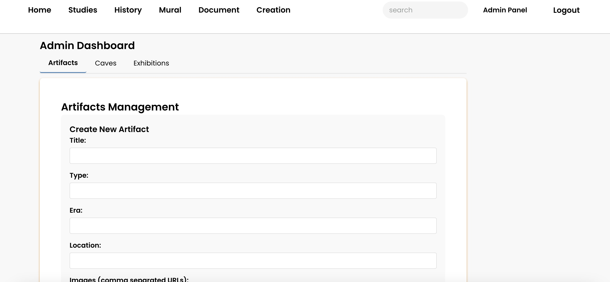
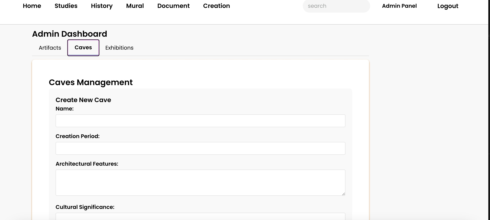

# Dunhuang Digital Museum
The Dunhuang Digital Museum will be an immersive virtual platform showcasing the artistic and cultural treasures of the Dunhuang Caves.

# Website Link
https://dunhuang-museum.onrender.com

# Teams Menbers
- Xi Xi 
- Lian Liu
- Shuojun Chen

## Video Link

### iteration 2: 
- Lian Liu: https://youtu.be/-tr40KSYCRo
- Xi Xi: https://youtu.be/hMG4uQLy4kk

## Features
- Authentication: Sign up, log in, and manage user sessions with role-based access for admins.
- AI Chatbot: Interact with an AI assistant to explore historical context and learn about artifacts and Dunhuang culture.
- Artifact Management: Admins can upload, edit, and organize artifact data with images and metadata.
- Digital Exhibitions: Create and curate virtual exhibitions showcasing selected artifacts and stories.
- Profile Management: Edit personal profile information and view browsing or collection history.
- Admin Dashboard: Manage users, moderate AI responses, and maintain exhibitions through a centralized panel.

### Chatbot API
Openrouter: https://openrouter.ai/
Create account and copy paste the OPENROUTER_API_KEY to .env

## Firestore Collections and Data Model
Based on our MongoDB data modeling:

### Artifacts Collection
- id: Unique artifact ID

- title, type, era, description, location

- images: Array of image URLs

### Caves Collection
- id, name, creationPeriod, architectural Features, significance

- artifacts: Array of artifact references
- images: Array of image URLs

### Users Collection
- id, username, email, password

#### Example Data Models
- Sample Admin User Document 
```json
{
        "_id": "67ecc5ee92156e21cf9072ec",
        "username": "admin1",
        "email": "admin1@example.com",
        "password": "admin123",
        "role": "admin",
        "savedArtifacts": [],
        "createdAt": "2025-04-02T05:06:54.753Z",
        "updatedAt": "2025-04-02T05:06:54.753Z",
        "__v": 0
}
```

- Sample User Document 
```json
{
        "_id": "67ee4c386954b7644bc2635c",
        "username": "testuser1",
        "email": "user1@example.com",
        "password": "user123",
        "role": "user",
        "savedArtifacts": [],
        "createdAt": "2025-04-03T08:52:08.224Z",
        "updatedAt": "2025-04-03T08:52:08.224Z",
        "__v": 0
    }
```
## CRUD Operations
- Create
    - Users register

    - Admins add artifacts/caves and create exhibitions
- Read
    - Users browse and search through artifacts, caves, and exhibitions
    - Filters available by type, era, location
    - Real-time chatbot provides descriptive context

- Update
    - Users update their profile and saved preferences

    - Admins and contributors update artifact/cave metadata

    - Contributions go through a review system
- Delete
    - Admins can delete inappropriate content


## Contributions
- Xi Xi:
    - Developed the Chatbot feature using the OpenRouter API, enabling users to interact and ask questions about Dunhuang artifacts and caves

    - Deployed the entire web application with Vercel (frontend) and Render (backend), ensuring reliable online access

    - Merged frontend and backend ports into a single unified environment for smoother development and deployment

    - Designed and implemented the Profile Page, allowing users to view and manage their personal information

    - Collaborated on testing, debugging, and UI improvements to enhance overall user experience
        <p align="center">
    
    
    
    </p>
- Lian Liu: 
    - Set up backend framework using Express.js and MongoDB
    - Developed the Admin Panel for managing artifacts and caves

    - Implemented CRUD logic (create, update, delete) with error handling

    - Designed role-based access (admin vs. user) and route protection
    -  Styled the dashboard and added image preview logic

    - Integrated with backend using Axios for full-stack functionality
    <p align="center">
    
    
    
    </p>

- Shuojun Chen: