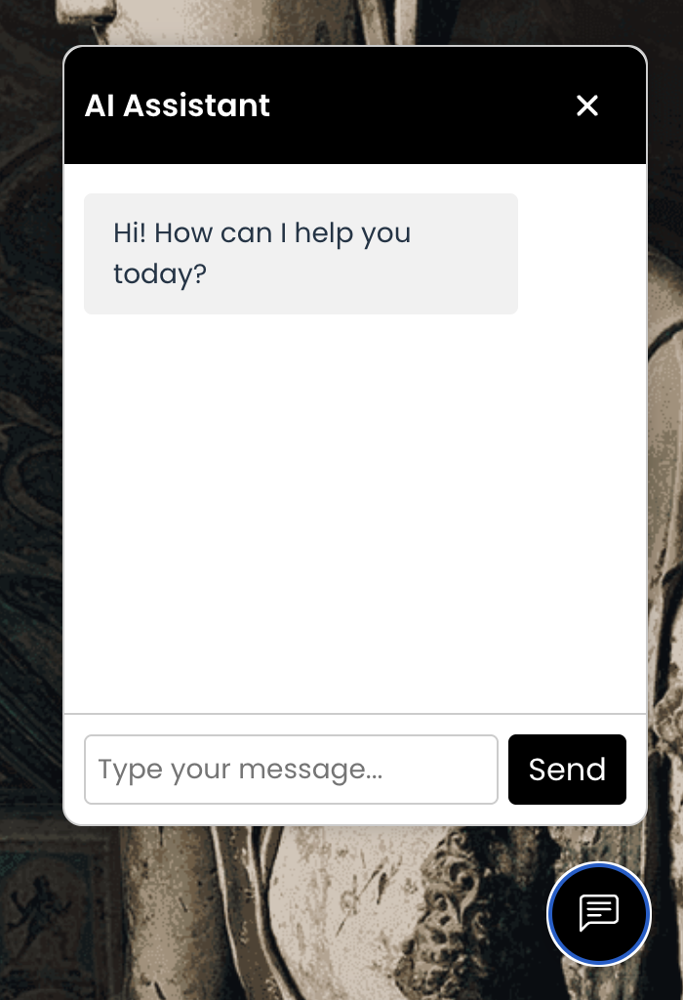
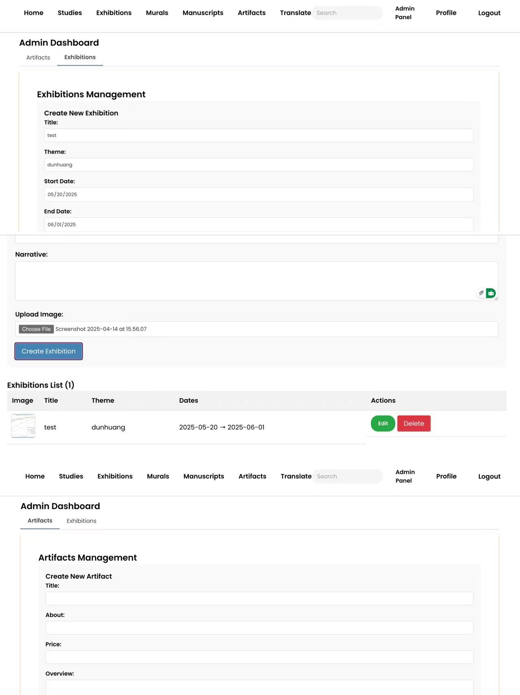

# Dunhuang Digital Museum
The Dunhuang Digital Museum will be an immersive virtual platform showcasing the artistic and cultural treasures of the Dunhuang murals.

# Website Link
https://dunhuang-museum.onrender.com

# Teams Menbers
- Xi Xi 
- Lian Liu
- Shuojun Chen

## Video Link
### Demo
### iteration 2: 
- Lian Liu: https://youtu.be/-tr40KSYCRo
- Xi Xi: https://youtu.be/hMG4uQLy4kk
- Shuojun Chen: https://youtu.be/T6_ktecRWzY


### iteration 3: 
- Lian Liu: https://youtu.be/oToeS0dNUPI
- Xi Xi: https://youtu.be/_Mobo66Dm8Y
- Shuojun Chen:


## Features
- Authentication: Sign up, log in, and manage user sessions with role-based access for admins.
- AI Chatbot: Interact with an AI assistant to explore historical context and learn about artifacts and Dunhuang culture.
- Artifact Management: Admins can upload, edit, and organize artifact data with images and metadata.
- Digital Exhibitions: Create and curate virtual exhibitions showcasing selected artifacts and stories.
- Profile Management: Edit personal profile information and view browsing or collection history.
- Admin Dashboard: Manage users, moderate AI responses, and maintain exhibitions through a centralized panel.
- Dynamic Translation: Add multi-language support to Chatbot by using LLM
- Static Translation: Add google translate for all texts on our webpage

## External API
### Chatbot API
Openrouter: https://openrouter.ai/
Create account and copy paste the OPENROUTER_API_KEY to .env

## 🔥 Firestore Collections and Data Models

This project uses MongoDB schema modeling. Below are the collections and their corresponding fields based on the implemented Mongoose models.

---

### 🏺 Artifacts Collection

Stores artifact product information.

**Fields:**
- `title` (String): Title of the artifact
- `about` (String): Short description or background
- `price` (Number): Price of the artifact
- `overview` (String): Detailed overview or highlights
- `images` (String): URL of the artifact image
- `createdAt` / `updatedAt`: Automatically generated timestamps

---

### 🖼️ Murals Collection

Represents murals and their classification details.

**Fields:**
- `title` (String): Title of the mural
- `period` (String): Historical period
- `description` (String): Description of the mural
- `category` (String): Main category (e.g., religious, decorative)
- `subcategory` (String): More specific classification
- `rating` (Number): Rating from 1 to 5
- `location` (String): Location of the mural
- `images` (Array of Strings): List of image URLs
- `createdAt`: Creation date (timestamp)

---

### 📜 Manuscripts Collection

Contains ancient manuscript records.

**Fields:**
- `title` (String): Manuscript title
- `period` (String): Time period or dynasty
- `description` (String): Detailed description
- `category` (String): Main category
- `subcategory` (String): Sub-category
- `rating` (Number): Rating from 1 to 5
- `images` (Array of Strings): List of image URLs
- `createdAt`: Timestamp of creation

---

### 🖥️ Digital Exhibitions Collection

Manages digital exhibition data.

**Fields:**
- `title` (String): Title of the digital exhibition
- `theme` (String): Exhibition theme
- `image` (String): Banner or feature image URL
- `startDate` / `endDate` (Date): Exhibition period
- `location` (String): Location (physical or virtual)
- `narrative` (String): Exhibition introduction or narrative
- `createdAt` / `updatedAt`: Timestamps

---

### 👤 Users Collection

Stores user authentication and profile information.

**Fields:**
- `username` (String): Unique username
- `email` (String): User email address
- `password` (String): Encrypted password
- `role` (String): Role of the user (either `'user'` or `'admin'`)
- `avatar` (String): Avatar image URL (default provided)
- `savedArtifacts` (Array of ObjectId): References to saved artifacts
- `createdAt` / `updatedAt`: Timestamps

---

### 👥 Sample User Documents

#### Admin User
```json
{
  "_id": "67ecc5ee92156e21cf9072ec",
  "username": "admin1",
  "email": "admin1@example.com",
  "password": "admin123",
  "role": "admin",
  "savedArtifacts": [],
  "createdAt": "2025-04-02T05:06:54.753Z",
  "updatedAt": "2025-04-02T05:06:54.753Z"
}

#### Regular User
```json
{
  "_id": "67ee4c386954b7644bc2635c",
  "username": "testuser1",
  "email": "user1@example.com",
  "password": "user123",
  "role": "user",
  "savedArtifacts": [],
  "createdAt": "2025-04-03T08:52:08.224Z",
  "updatedAt": "2025-04-03T08:52:08.224Z"
}

## CRUD Operations
- Create
    - Users register

    - Admins add artifacts/murals and create exhibitions
- Read
    - Users browse and search through artifacts, murals, and exhibitions
    - Filters available by type, era, location
    - Real-time chatbot provides descriptive context

- Update
    - Users update their profile and saved preferences

    - Admins and contributors update artifact/mural metadata

    - Contributions go through a review system
- Delete
    - Admins can delete inappropriate content(exhibitions or artifacts)


## Contributions
- Xi Xi:
    - Developed the Chatbot feature using the OpenRouter API, enabling users to interact and ask questions about Dunhuang artifacts and murals

    - Deployed the entire web application with Vercel (frontend) and Render (backend), ensuring reliable online access

    - Merged frontend and backend ports into a single unified environment for smoother development and deployment

    - Designed and implemented the Profile Page, allowing users to view and manage their personal information

    - Collaborated on testing, debugging, and UI improvements to enhance overall user experience
        <p align="center">
    
    
    
    
    </p>
- Lian Liu: 
    - Set up backend framework using Express.js and MongoDB
    
    - Developed the Admin Panel for managing artifacts and exhibitions

    - Implemented CRUD logic (create, update, delete) with error handling

    - Designed role-based access (admin vs. user) and route protection

    - Built image preview and dynamic form logic for editing artifacts and exhibitions

    - Connected frontend to backend using Axios for full-stack integration

    -  Styled dashboard views with custom CSS to ensure visual clarity and consistency

    - Integrated with backend using Axios for full-stack functionality

    - Added responsive hero banners and unified layout styles across key pages:
    
        Studies, Animal Murals, Flying Murals, Dance, Architecture, Manuscripts, Exhibitions, Admin Panel

    - Implemented search page with dynamic query support (/search?q=) and structured result grouping

    - Added a static 5-star rating display for mural cards to enhance UX and prepare for future review features
    <p align="center">
    
    
    
    </p>

- Shuojun Chen:
    - Implement 10 languages' translations to Chatbot through the OpenRouter API, to better serve non-English users

    - Built up the google translate widget for all static texts on website

    - Add search functionality to the nav bar

    - Collaborated on testing, debugging, and UI improvements to enhance overall user experience
        <p align="center">
    
    
    
    </p>